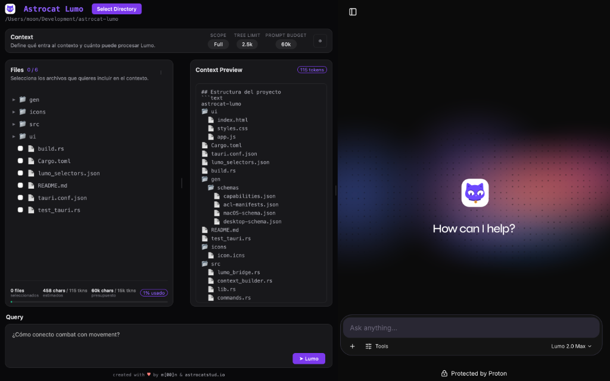
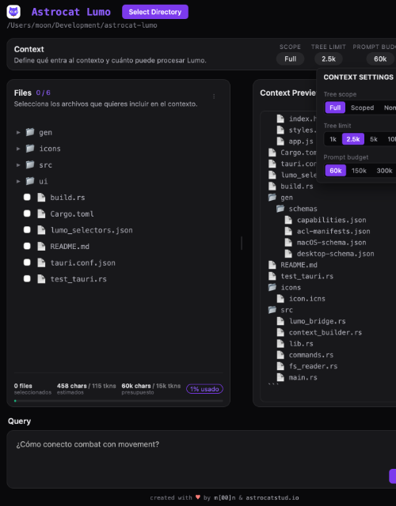
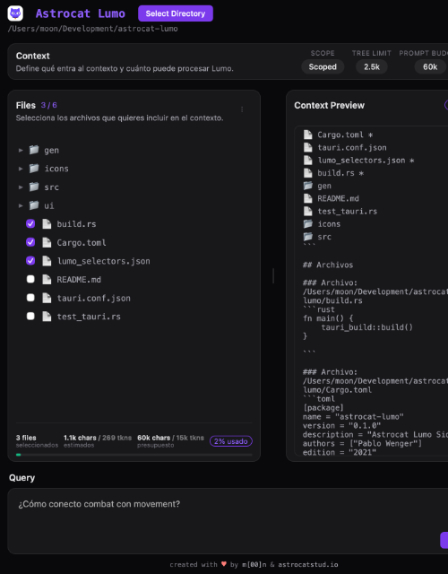

# Astrocat Lumo 🐾

**Astrocat Lumo** es un *sidecar* de escritorio nativo, ultrarrápido y seguro, construido en **Rust + Tauri 2.0**. Su objetivo es inspeccionar ecosistemas locales de código, ensamblar contextos estructurados en tiempo real, y sincronizarlos fluidamente con **Proton Lumo** (`lumo.proton.me`) dentro de una experiencia de ventana dual.

---
##### 
---

## ✨ Características Principales

### 🖥️ Interfaz Dual Unificada
- **Arquitectura Split-View:** Panel de control nativo a la izquierda (Astrocat) y entorno web inyectado a la derecha (Proton Lumo).
- **Layout Fluido:** Divisores 100% redimensionables en tiempo real, sin *lag* y con retención de estado.

### 🧠 Explorador Inteligente (*Smart Tree*)
El backend en Rust respeta tu `.gitignore` y filtra automáticamente extensiones binarias y directorios pesados (`node_modules`, `target`, `.git`) para mantener un contexto prístino.

#### Casos de Uso del Contexto

##### 1. Árbol de Contexto Completo (Full Scope)
Captura la topología completa del proyecto, ideal para cuando Lumo necesita entender la estructura general de tu repositorio.

##### 2. Árbol Recortado (Scoped)
Genera un árbol topológico inteligente (`🌿 Scoped`) que se recorta para mostrar únicamente las ramas que conectan los archivos que has seleccionado, ahorrando miles de tokens sin perder contexto estructural.

##### 3. Control de Presupuesto (Token Limits)
Barra de progreso visual que monitorea constantemente los caracteres leídos y los tokens estimados frente a tu límite configurado, alertando visualmente si te acercás al presupuesto máximo.

##### 4. Inyección en Vivo
Lumo ensambla y formatea el código instantáneamente, inyectándolo en el área de texto de Proton Lumo para que puedas chatear con tu código sin fricciones.

---

## 🚀 Instalación y Uso

### Descargar Ejecutable
Dirígete a **[Releases](https://github.com/PabloWenger/astrocat-lumo/releases)** y descarga la última versión (`.dmg`, `.exe` o `.deb`).

**Nota para usuarios de macOS:**
Dado que la aplicación aún no está firmada, macOS la pondrá en cuarentena. Para abrirla tras instalarla en Aplicaciones, ejecuta:
```bash
xattr -cr /Applications/Astrocat\ Lumo.app
```

### Compilar desde el Código Fuente
Asegúrate de tener [Rust](https://www.rust-lang.org/) y las [dependencias de Tauri](https://v2.tauri.app/start/prerequisites/).
```bash
cargo tauri dev   # Modo desarrollo
cargo tauri build # Compilar para producción
```

---
#### Screenshot
##### 
##### 

---

## 📄 Licencia

MIT / Apache 2.0 - created with ♥ by [m[00]n](https://github.com/PabloWenger) & [astrocatstud.io](https://astrocatstud.io).
